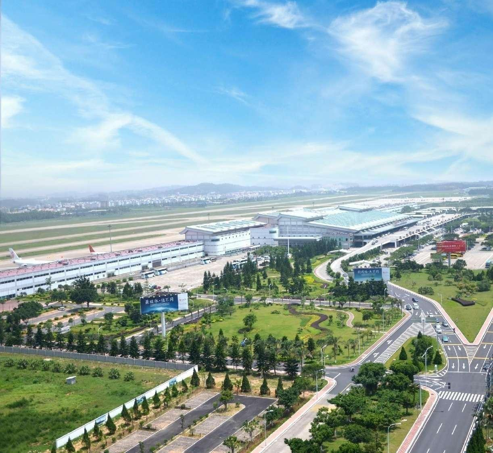
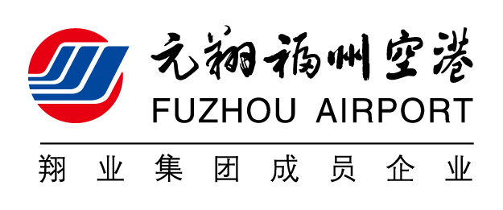
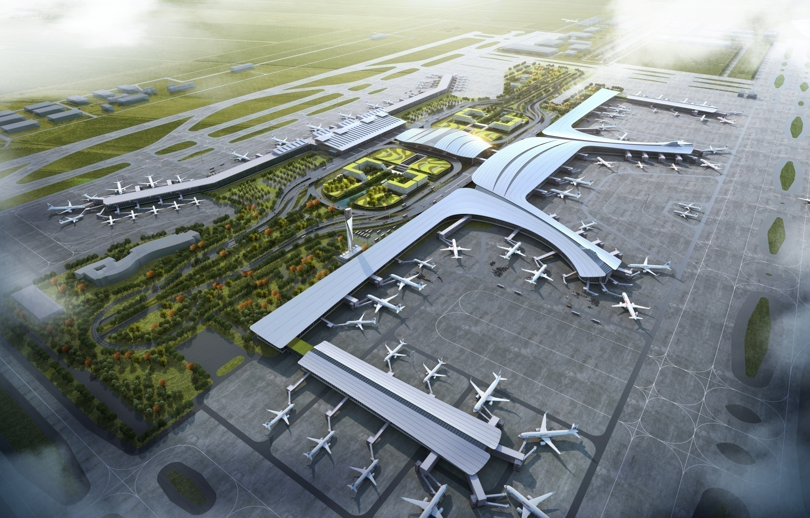
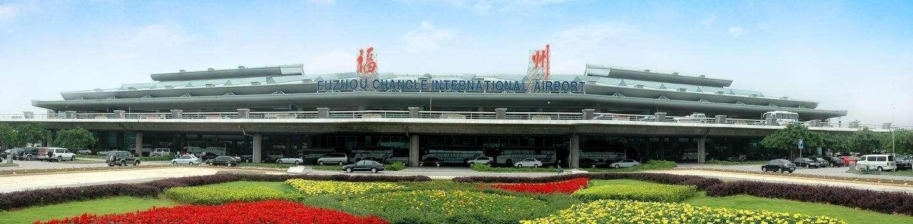

# native-final

- Source: `native-final.pptx`
- Total slides: 12

## Slide 1

航站楼护卫岗位外包项目汇报

面向管理层的项目…

## Slide 2

汇报目录

项目背景与范围

岗位方案与风险

成本测算与建议

实施计划与请示事项

## Slide 3

第01章

项目范围

福 州 空 港 概 况

## Slide 4

02

岗位配置按风险和客流分层

  - 关键技术

  - 21

高峰调度依赖经验

岗位职责边界不清

现状

方案

按区域分层配置

建立交接检查

## Slide 5

01

关键指标集中在三项可执行动作

  - 关键技术

  - 21

统一岗位口径

建立交接检查

按月复盘风险

92%

目标满意度

指标页只突出一个可跟踪目标。

## Slide 6

03

不同区域的配置需求存在明显差异

  - 关键技术

  - 21

类别比较直接取自参考资料。

120人

88人

64人

42人

航站楼

交通中心

外围区域

机坪通道

## Slide 7

02

岗位职责需要覆盖全天候运行

  - 关键技术

  - 21

巡逻、国际三超、安全处置与贵宾护卫形成连…

## Slide 8

01

项目实施按三个阶段推进

  - 关键技术

  - 21

现状

目标

## Slide 9

02

服务质量需要可追溯的证据链

  - 关键技术

  - 21

将巡查、交接和异常处置记录统一归档，支持…

## Slide 10

08

岗位构成以一线护卫为主

  - 关键技术

  - 21

护卫岗 120人

构成图只呈现可核验的岗位占比。

引导岗 88人

巡逻岗 64人

管理岗 12人

构成

## Slide 11

08

人员配置随阶段逐步稳定

  - 关键技术

  - 21

108人

106人

趋势图用于辅助判断实施节奏。

104人

84人

60人

1月

2月

3月

4月

5月

## Slide 12

形成可执行、可追溯、可复盘的护卫服务体系

